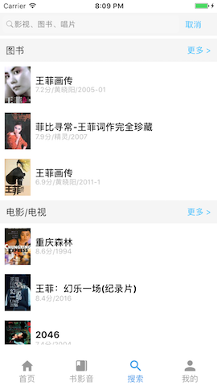
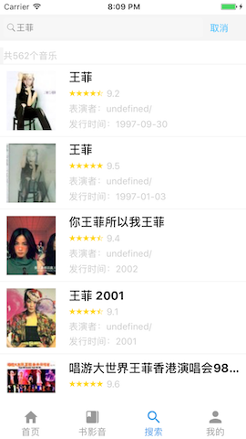

# Instant Message
##About
**A study Demo(Instant Message App) write in React-Native**
>Originally I plan to program a Project like Douban App via Douban Open Api, but I found that many Api doesn't support for individual developer later. so, I just finished a part of this App, but, **Don't worry, it can run correctly**.

## Screenshot 

##Usage
>- Step 1:`clone`
>
 `$ git clone git@github.com:keith527/InstantMessage.git`
> - Step 2:`cd`
> 
 `$ cd InstantMessage`
> - Step 3:`install`
> 
 `$ npm install`and
 `$ react-native link` 
 
> Tips: Because I used some third-party library for My Project, so, if you meet some problem about module doesn't work ,please check the module installed correctly. Especially the module `react-native-vector-icons`,You may do something according to [react-native-vector-icons](https://github.com/oblador/react-native-vector-icons)
> 
> 
> - Step 4:`run`
> 
 `$ react-native run-ios`or`$ react-native run-android`

##TODO

- Add seach history function
- Add hot update
- Add Testing code

##Open Api

- [Douban Api](https://developers.douban.com/wiki/?title=api_v2)

## License

Apache License 2.0

